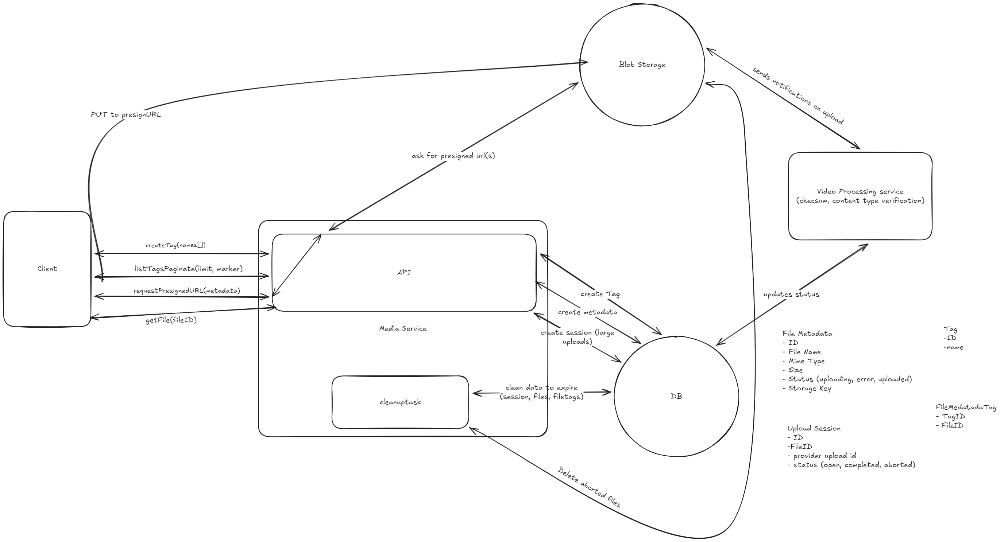

# Score Play

**Score Play** is a production-ready, high-performance Golang file upload and video processing service. It leverages **Hexagonal Architecture**, **Event-Driven Design**, and **Cloud-Native patterns** to ensure scalability, maintainability, and reliability.

---

## 🚀 Getting Started

### Prerequisites

- **Go**: Version 1.25 or higher
- **Docker & Docker Compose**: For running infrastructure services (Postgres, MinIO, NATS)
- **Make**: For executing build and utility commands

### Installation & Setup


1. **Environment Configuration:**
    The project uses a `.env` file for configuration. A default `.env` is provided in the root directory. Ensure it fits your environment needs (ports, credentials).

2. **Start the Application:**
    Use the provided `Makefile` to spin up the entire stack using Docker Compose.
    ```bash
    make up
    ```
    This command starts:
    -   **API**: The main HTTP service.
    -   **Video Processing Worker**: Asynchronous worker for video tasks.
    -   **PostgreSQL**: Metadata database.
    -   **MinIO**: Object storage (S3 compatible).
    -   **NATS**: Message broker (JetStream).

3. **Run Migrations:**
    Initialize the database schema:
    ```bash
    make migrate-up
    ```

4. **Verify Status:**
    Check if all services are running:
    ```bash
    make logs
    ```

---

## 📖 Documentation

### API Reference
The API definition is available in the **OpenAPI 3.0** format.
-   **File**: - [OpenAPI specification](docs/openapi.yaml)
-   You can view this file using any Swagger/OpenAPI viewer (e.g., Swagger Editor, Postman).

#### Quick Endpoint List:
-   `GET /health`: Health check.
-   `POST /tag`: Create multiple tags.
-   `GET /tag`: List tags with pagination.
-   `POST /file/upload`: Initiate simple upload (get presigned URL).
-   `POST /file/upload/multipart`: Initiate a multipart session.
-   `POST /file/upload/multipart/{id}/parts`: Get presigned URLs for specific parts.
-   `GET /file/upload/multipart/{id}/parts`: List parts already uploaded.
-   `POST /file/upload/multipart/{id}/complete`: Finalize multipart upload.
-   `GET /file/{id}`: Get file info and a presigned download URL.


### Testing
The project includes unit tests and integration tests.

**Run Unit Tests:**
```bash
make test
```
### Makefile
A makefile is provided with multiple commands. Feel free to check it out !

```bash
make help
```

### Minio Admin Panel
Minio provides an admin panel. By default, its url is : http://127.0.0.1:9001/browser/

Connect with the credentials you provided in your .env file !

---

## Score-Play CLI Client

A simple Python CLI client to interact with the Score-Play API.

## Installation

1. Make sure you have Python installed.
2. Install dependencies:
   ```bash
   pip install -r requirements.txt
   ```

## Usage

Set the `API_URL` environment variable if your API is not running at `http://localhost:8080/api/v1`.

```bash
export API_URL=http://localhost:8080/api/v1
```

### Tag Operations


- **Create tags:**
  ```bash
  python client.py tag create tag1 tag2 tag3
  ```
- **List tags:**
  ```bash
  python client.py tag list --limit 10
  ```
- **List tags (manual pagination):**
  ```bash
  python client.py tag list --limit 10 --marker <marker_value>
  ```
- **List tags (automatic pagination):**
  ```bash
  python client.py tag list --limit 10 --auto
  ```

### File Operations

- **Simple Upload (Request + PUT):**
  ```bash
  python client.py file upload /path/to/file.mp4 tag1 tag2
  ```
- **Multipart Upload (Full):**
  ```bash
  python client.py file upload-multipart /path/to/large_file.mp4 tag1 tag2
  ```
- **Test Resume Flow (Simulated failure & resume):**
  ```bash
  # This command uploads 50%, "crashes", lists parts, and resumes.
  python client.py file test-resume-flow /path/to/large_file.mp4 tag1 tag2

  # You can specify when to stop (in number of parts):
  python client.py file test-resume-flow /path/to/large_file.mp4 tag1 tag2 --stop-after 5
  ```
- **Test Bad Checksum (Verifies data integrity check):**
  ```bash
  # This tries to upload a corrupted part using a valid signature.
  # MinIO should reject it with 400 Bad Request.
  python client.py file test-bad-checksum /path/to/file.mp4 tag1
  ```
- **Get File Info (and download URL):**
  ```bash
  python client.py file get <file_id>
  ```
- **Download a file:**
  ```bash
  python client.py file download <file_id>
  ```


## 🏗 Architecture & Design Decisions

This project is built with strict adherence to software engineering best practices to ensure it is robust, scalable, and easy to maintain.

### 1. Global Architecture Overview



The system is composed of two main Go services and three infrastructure components, communicating via HTTP and NATS.

1.  **API Service**: Handles HTTP requests, metadata management, and S3 presigned URL generation.
2.  **Worker Service**: Consumes events from NATS to perform heavy background tasks (e.g., video transcoding, analysis).
3.  **Infrastructure**:
    -   **MinIO (S3)**: Stores raw and processed files.
    -   **PostgreSQL**: Stores persistent metadata (file info, tags, upload sessions).
    -   **NATS JetStream**: Guarantees message delivery between Minio and Worker.

**Data Flow:**
1.  **Upload Initiation**: Client requests an upload session from the API.
2.  **Direct Transfer**: Client uploads file parts *directly* to MinIO using presigned URLs (bypassing the API for data transfer).
3.  **Completion**: Client notifies the API that the upload is finished.
4.  **Event Publishing**: API assembles the file, updates DB, and publishes a `FileUploaded` event to NATS.
5.  **Async Processing**: The Worker service receives the event, verifies the file, and updates the status.

### 2. Hexagonal Architecture (Ports & Adapters)

We strictly follow the **Hexagonal Architecture** (also known as Clean Architecture).

-   **Core (Domain)**: Located in `internal/core`. This contains the business logic and entities. It defines **Ports** (interfaces) for what it needs (e.g., `FileRepository`, `EventBroker`). It has **zero dependencies** on HTTP, SQL, or AWS libraries.
-   **Adapters**: Located in `internal/adapters`. These implement the Ports.
    
**Why?**
-   **Isolation**: We can upgrade libraries or switch frameworks without touching business logic.
-   **Testability**: We can write unit tests for the Core by simply mocking the interfaces (Ports). No need to spin up a real database or S3 bucket for logic tests.

### 3. Key Design Patterns & Technologies

#### 🐳 Containerization (Docker) & Multi-Stage Builds
-   **Why?** We use Docker to guarantee that the application runs exactly the same in development, testing, and production.
-   **Multi-Stage Builds**: Our `Dockerfile` uses a "builder" stage (Golang image) to compile the code, and a "runner" stage (Alpine image) to deploy it.
    -   *Benefit*: The final production image is extremely small (~15MB) and secure, as it contains **only** the compiled binary, without the source code, Go compiler, or unnecessary system tools.

#### 🛠 Unit of Work (Transactional Integrity)
We implement the **Unit of Work** pattern in the Postgres adapter.
-   **Why?** Operations often involve multiple repositories (e.g., "Save File Metadata" AND "Save Tags").
-   **How?** The Unit of Work ensures these execute within a single Database Transaction. If saving tags fails, the file metadata creation is rolled back, preventing data inconsistency.

#### 🌐 HTTP Routing with Chi (v5)
-   **Why?** Chi is lightweight, idiomatic, and 100% compatible with the standard `net/http` interface.
-   **Versioning**: We use Chi's mounting capability (`r.Mount("/v1", v1Router)`) to cleanly separate API versions. This allows us to introduce v2 without breaking existing v1 clients.

#### 📝 Structured Logging (slog)
-   **Why?** We use Go 1.21+'s built-in `log/slog`. 

### 4. Deep Dive: "Why this approach?"

#### 📦 S3 Multipart Uploads & Presigned URLs
We chose **Multipart Uploads** for large files with **Presigned URLs** over streaming through the API. Small files are uploaded via a single presigned url.

1.  **Resilience on Unstable Connections (Sports & Travel)**:
    -   In scenarios like **sports events** or **business travel** (hotels/airports/trains), internet connections are notoriously unstable and packet loss is common.
    -   If a 5GB upload fails at 99%, a standard stream requires restarting from byte 0.
    -   With **Multipart**, the file is split into small chunks (e.g., 5MB). If a chunk fails, only that 5MB is retried. The upload can even be paused and resumed later.

2.  **Scalability**:
    -   Streaming large files through the Golang API server consumes significant memory and CPU and blocks connections.
    -   By generating Presigned URLs, the client uploads *directly* to MinIO/S3. The API only handles tiny JSON requests (signaling), allowing a single small API instance to coordinate terabytes of uploads.

3.  **Data Integrity (Checksums)**:
    -   We enforce `SHA-256` checksums in the presigned URLs (`x-amz-checksum-sha256`).
    -   **Why?** This ensures end-to-end integrity. If a bit flips during transmission (common in poor networks), S3 will calculate the checksum of the received data, compare it to the one signed in the URL, and reject the corrupted part immediately. This guarantees that the file stored in S3 is bit-for-bit identical to the file on the user's disk.

#### 🗃️ Why the `upload_session` table?
You might ask: *"Why store upload state in Postgres? Why not just talk to S3?"*

1.  **Orchestration & Resumability**:
    -   S3 Multipart uploads require a specific `UploadID`. We store this in the `upload_session` table.
    -   If a user's network drops, they can request the status of their session. The API uses the stored `UploadID` to ask S3 "Which parts are already there?" and tells the client to resume from Part X.

2.  **Security & Control**:
    -   The session binds a specific file entry to an active upload process.
    -   It prevents "Zombie Uploads": We set an strict `expires_at` (e.g., 24h). Even if S3 allows the upload to hang forever, our system invalidates the session, preventing clients from uploading to stale IDs.

3.  **Cost Management (Garbage Collection)**:
    -   This is the most critical reason. If a user uploads 4GB of a 5GB video and closes their browser, those 4GB remain in S3 charging money.
    -   Our **Cleanup Worker** scans the `upload_session` table for `status='open' AND expires_at < now()`. It finds the specific `UploadID` and instructs S3 to **Abort** that upload, freeing the storage immediately.

#### 📨 NATS JetStream & Event Driven Architecture
1.  **Decoupling**: The API shouldn't wait 10 minutes for a video to process. It returns "Success" immediately after upload, and the work happens in the background.
2.  **Resilience**: We use **JetStream** (persistence), not just core NATS (fire-and-forget). If the Worker service crashes, the message remains in the stream. When the Worker restarts, it picks up exactly where it left off, ensuring zero data loss.
3.  **Independent Scaling**: We can run 1 API instance (IO-bound) and 50 Worker instances (CPU-bound). They scale independently based on load.
4. **Futureproof**: Should we need to have more work done on the file (compressing, splitting,...), we already have a dedicated service. 
### 5. Data Access Patterns & Optimization

Efficient data access is critical for high-performance applications. Here is how we optimize for both **Write** (Upload) and **Read** (Listing/Filtering) patterns.

#### 🗄️ Database Indexing Strategy
We use specific PostgreSQL indexes to ensure performance for critical paths:

1.  **Cleanup Jobs (`idx_upload_session_expiry`)**:
    -   *Query*: "Find all sessions where status='open' AND expires_at < now()"
    -   *Index*: `(status, expires_at)`
    -   *Why?* The cleanup background worker runs frequently. This composite index allows it to jump directly to expired rows without scanning the entire table, ensuring the cleanup job remains instantaneous even with millions of history rows.

2.  **Tag Filtering (`filetags_tag_file_idx`)**:
    -   *Query*: "Get all files with tag 'football'"
    -   *Index*: `(tag_id, file_id)` on the join table.
    -   *Why?* This allows extremely fast retrieval of file IDs for a specific tag. We also maintain the reverse index `(file_id)` to quickly show tags when viewing a single file.

3.  **Feed / List Optimization**:
    -   *Index*: `(status, updated_at) WHERE deleted_at IS NULL` on `file_metadata`.
    -   *Why?* Most user queries are "Show me the latest completed videos". This partial index excludes failed/uploading files and deleted entries, creating a compact index for the most common "Feed" query.

### 6. Scalability & Performance Analysis

This architecture is designed to scale horizontally to handle **millions of files per day**.

-   **API Scalability (Horizontal)**:
    -   The API is **stateless**. It can be deployed behind a Load Balancer.
    -   If load increases, we simply spin up more API containers. Since they don't hold the file data (S3 does), they are extremely lightweight.
-   **Worker Scalability (Competing Consumers)**:
    -   The workers consume from a NATS Queue Group. This implements the **Competing Consumers** pattern.
    -   If the processing backlog grows, we can auto-scale the number of Worker instances. 100 workers can process 100 videos in parallel.
-   **Performance Estimation**:
    -   The API only handles control signals (JSON). A single Go instance can easily handle **1,000+ req/sec**.
    -   Assuming 3 requests per upload (Init, Sign Parts, Complete), one API instance could coordinate ~300 uploads/sec, or **~25 million uploads per day**.
    -   The real bottleneck is S3 Bandwidth and Worker CPU, both of which are scalable cloud resources.

---

## 🔮 Future Improvements

If given more time, the following enhancements would be prioritized:

1.  **Secret Management**: Replace environment-based secrets with a dedicated Secret Management service like **HashiCorp Vault**, **AWS Secrets Manager**, or **Google Secret Manager**. This would improve security by enabling secret rotation, fine-grained access control, and audit logging.
2.  **Storage Lifecycle (Glacier)**: Implement automated S3 Lifecycle Rules to transition files older than 30 or 90 days to **Glacier** or **Deep Archive**. This is critical for cost optimization in a high-volume system.
3.  **Authentication & Authorization**: Implement JWT-based auth or integrate with an OIDC provider (e.g., Keycloak, Auth0) to secure endpoints.
4.  **Observability**: Fully integrate OpenTelemetry for distributed tracing and Prometheus for metrics to monitor system health and performance.
5.  **Rate Limiting**: Add middleware to prevent abuse and ensure fair usage of the API.
6.  **CDN Integration**: Configure a Content Delivery Network (CDN) in front of MinIO for faster file retrieval globally.
7.  **Circuit Breakers**: Implement circuit breakers for external dependencies (Database, MinIO, NATS) to improve system resilience during outages.
8.  **CI/CD Pipeline**: specific GitHub Actions or GitLab CI configuration for automated testing and deployment.

---

